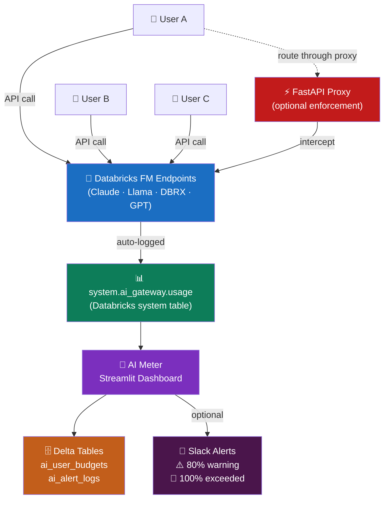

# 🤖 AI Meter

**AI Meter** is a Databricks-native app that gives you real-time visibility into how your team uses AI — who is calling which models, how many tokens they're burning, and whether anyone is blowing past their daily budget. No proxy required: it reads directly from `system.ai_gateway.usage`.

---

## Architecture



Zero instrumentation on the user side — any call to a Foundation Model endpoint shows up automatically.

---

## Dashboard

### 👥 Users tab — who is using AI today

```
Active Users Today    Total Tokens     Total Requests   At Warning (≥80%)   Exceeded
      54               498,004,301         12,759              3                 1
━━━━━━━━━━━━━━━━━━━━━━━━━━━━━━━━━━━━━━━━━━━━━━━━━━━━━━━━━━━━━━━━━━━━━━━━━━━━━━

  ▲ 180K
  │   ██
  │   ██
  │   ██  ██
  │   ██  ██  ██
  │   ██  ██  ██  ██  ██  ██
  └──────────────────────────────── top users by token consumption
      alice  bob  carol  dave  …
```

Hourly activity overlay shows both token volume and active user count on the same chart so you can see if a spike is one heavy user or the whole team.

---

### 🤖 Models tab — which AI models your team is using

```
  Token Share by Model                 Unique Users per Model
  ┌──────────────────────────┐         ┌────────────────────────────┐
  │        ╭──────╮          │         │  Claude Sonnet  ████████ 31│
  │  DBRX ╱        ╲ Claude  │         │  Llama 3.3 70B  ██████  22 │
  │  14%  │   ●    │  Opus   │         │  Claude Haiku   █████   18 │
  │       │  38%   │  23%    │         │  DBRX Instruct  ████    14 │
  │        ╲      ╱          │         │  GPT-4o         ██       7 │
  │   Llama ╰────╯  Haiku    │         └────────────────────────────┘
  │   3.3   17%    8%        │
  └──────────────────────────┘
```

---

### 📈 Trends tab — 7-day workspace activity

```
Tokens (M)  Active Users
  650 ─┤                                        ● 51
  600 ─┤  ●                   ●
  550 ─┤       ●         ●         ●       ●
  500 ─┤                                              ●  ← today
  450 ─┤
       └─────────────────────────────────────────────────► day
       Mon   Tue   Wed   Thu   Fri   Sat   Sun

  Per-user trend (top 10 users, 7-day line chart)
  alice  ─────────────────────────╮  peaked Wed, steady since
  bob    ───────────╮             │  burst on Tuesday
  carol  ──────────────────────────  consistent daily user
```

---

### ⚠️ Budgets & Alerts tab — who is at risk

```
  Status   User                        Tokens Used   Daily Limit   % Used
  ──────   ──────────────────────────  ──────────    ──────────    ──────
  🔴       alice@company.com           2,847         2,000         142.4%
  🟡       bob@company.com             1,743         2,000          87.2%
  🟡       carol@company.com           1,612         2,000          80.6%
  🟢       dave@company.com              431         2,000          21.6%
  🟢       eve@company.com               87          5,000           1.7%
```

Limits are configurable per user from the sidebar. A Slack alert fires once when a user crosses 80%, and again when they hit 100%.

---

## Project structure

```
app/
├── main.py           FastAPI proxy — optional, adds per-request interception
├── config.py         Settings loader (.env → env vars → ~/.databrickscfg)
├── database.py       Delta table CRUD via Databricks SDK Statement Execution API
├── system_tables.py  Read-only queries against system.ai_gateway.usage
├── tracker.py        Budget check + usage logging + alert triggering
├── alerting.py       Slack alerts via webhook or bot token (uses httpx)
└── models.py         Pydantic request/response models

dashboard/
└── app.py            Streamlit app (the Databricks App entry point)

setup/
└── init_tables.py    One-time Delta table creation

app.yaml              Databricks App run config
databricks.yml        Databricks Asset Bundle config
```

---

## Setup

### 1. Delta tables (run once)

```bash
python setup/init_tables.py
```

Creates three Delta tables in your configured catalog/schema:

| Table | Purpose |
|---|---|
| `ai_usage_logs` | Proxy-tracked calls (only if using the FastAPI proxy) |
| `ai_user_budgets` | Per-user daily token limits + Slack IDs |
| `ai_alert_logs` | Alert history with per-day deduplication |

### 2. Configuration

Copy `.env.example` to `.env` and fill in your values:

```bash
# Databricks workspace
DATABRICKS_HOST=https://<your-workspace>.cloud.databricks.com
DATABRICKS_TOKEN=<your-pat-token>
DATABRICKS_SQL_WAREHOUSE_ID=<serverless-warehouse-id>

# Unity Catalog — where budgets and alert logs are stored
DATABRICKS_CATALOG=<your-catalog>
DATABRICKS_SCHEMA=<your-schema>

# Foundation Model endpoint to proxy (optional)
FM_ENDPOINT_NAME=databricks-meta-llama-3-1-70b-instruct

# Budget defaults
DEFAULT_DAILY_TOKEN_LIMIT=2000
SOFT_ALERT_THRESHOLD=0.8

# Slack (optional — pick one)
SLACK_WEBHOOK_URL=https://hooks.slack.com/services/…
SLACK_BOT_TOKEN=xoxb-…
SLACK_DEFAULT_CHANNEL=#ai-usage-alerts
```

> **Note:** When deployed as a Databricks App the token is not required — the app authenticates via OAuth automatically.

### 3. Run locally

```bash
pip install streamlit plotly
streamlit run dashboard/app.py

# Optional proxy
uvicorn app.main:app --reload
```

### 4. Deploy as a Databricks App

```bash
# Upload source to workspace
databricks workspace import-dir . /Workspace/Users/<you>/ai-meter --overwrite

# Create (first time only)
databricks apps create <your-app-name> \
  --description "AI Token Usage Meter"

# Deploy
databricks apps deploy <your-app-name> \
  --source-code-path /Workspace/Users/<you>/ai-meter
```

> Grant the app's service principal `USE CATALOG`, `USE SCHEMA`, and `SELECT + MODIFY` on your catalog/schema tables after the first deploy.

---

## Proxy API (optional)

Point your application at the proxy instead of the FM endpoint to enforce limits at the request level.

```
POST /v1/chat/completions        OpenAI-compatible proxy
GET  /v1/usage/{user_id}         Current token usage for a user
GET  /v1/usage                   All users' usage today
POST /v1/budgets                 Create or update a user budget
GET  /v1/budgets/{user_id}       Get a user's configured budget
GET  /health                     Health check
```

**Example request:**

```bash
curl -X POST http://localhost:8000/v1/chat/completions \
  -H "X-User-ID: alice@company.com" \
  -H "Content-Type: application/json" \
  -d '{"messages": [{"role": "user", "content": "Summarise this report…"}]}'
```

**Response when limit exceeded (`HTTP 429`):**

```json
{
  "error": "daily_token_limit_exceeded",
  "user_id": "alice@company.com",
  "tokens_used": 2847,
  "daily_limit": 2000,
  "message": "You have exceeded your daily token budget. Try again tomorrow."
}
```

---

## Slack alerts

```
⚠️  AI Token Budget Warning
alice@company.com  You've used 87.2% of your daily token budget (1,743 / 2,000 tokens).
User: alice@company.com · Used: 1,743 · Limit: 2,000 tokens/day · 87.2%

🚨  AI Token Budget Exceeded
alice@company.com  You've exceeded your daily token budget (2,847 / 2,000 tokens).
Further requests will be blocked.
```

Alerts fire once per threshold per user per day — no repeat spam.

---

## Requirements

- Databricks workspace with Unity Catalog enabled
- Access to `system.ai_gateway.usage` (available in all workspaces using Foundation Model APIs)
- A Serverless SQL warehouse (required for Unity Catalog DDL)
- Python 3.10+
